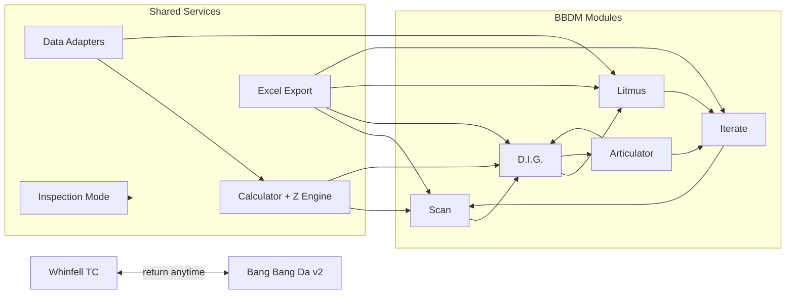

# Bang Bang Da Machine v2.0 — Micro-Chunk Development Plan

**Status:** Chunk 23 shipped · **Next:** Chunk 24 (`litmus-midwest-compute-primary`)
**Master spec:** [`BBDM_v2_Master_Spec.md`](BBDM_v2_Master_Spec.md)

**Authority:** [`Whinfell Transmission Control — Bang Bang Da Machine v2.0.txt`](Whinfell%20Transmission%20Control%20%E2%80%94%20Bang%20Bang%20Da%20Machine%20v2.0.txt)  
**Baseline:** v1.2 shipped (`bang_bang_da_calculator.py`, `rv_history.py`, `bang_bang_da_machine.html`)  
**Delta from prior draft:** Spec expands 5→8 trades, replaces simple gate-litmus with full corporate Litmus, adds Articulator + Iterate backtesting, mandates Excel export on every major view.

---

## Spec-to-Code Gap Analysis

| Spec § | v1.2 today | v2 target |
|--------|------------|-----------|
| §2 Five modules | Scan-like table + detail only | Scan · D.I.G. · Iterate · Litmus · Articulator |
| §3 Risk dashboard | Single gate chip | Whinfell (ex-China) · SQ3 · Combined |
| §4 Eight trades | 5 sleeves (calendar/crush only) | BTC/ETH/Midwest **basis + calendar** + SOFR + 2s10s |
| §4 Z buckets | BANG/WATCH/PASS/BLOCKED | PASS · 1x · 2x · 3x (+ gate BLOCKED) |
| §5 Litmus | None | Per-trade corporate/industry tables + filing alerts |
| §6 Articulator | None | Grok primary + Comet secondary commentary |
| §6 Iterate | JSON export only | Trade Modeler + backtest scaffold |
| §8 Exports | JSON only | Excel every view · Copy buttons · Inspection Mode |

**Hydration mappings for §3 scores:**
- Whinfell (ex-China) → `task_force.specialists.global_transmission.global_only_score` (fallback: compute from liquidity+credit+basis nodes)
- SQ3 → `china.sq3_score`
- Combined → `global.whinfell_score`

---

## Architecture (Circular Journey)



**Sequencing rule:** Foundation → Data (8 series) → Scoring → Litmus (per trade) → Articulator → UI layers (Scan→Dig→Iterate) → Exports/Inspection → Integration/Ops. **Do not build Iterate backtest before Litmus schema frozen.**

---

## Phase A — Foundation (Shared) · Chunks 01–06

### Chunk 01 — `bbdm-v2-spec-lock` ✅ **Done** (July 7, 2026)
- **Accomplish:** Copy human spec into repo; add implementation delta appendix (v1.2→v2)
- **Inputs:** Human spec txt file
- **Outputs:** `01_Strategy_Docs/BBDM_v2_Master_Spec.md` · `01_Strategy_Docs/BBDM_v2_Development_Plan.md`
- **Depends on:** —
- **Layer:** Shared

### Chunk 02 — `bbdm-v2-report-schema` ✅ **Done** (July 7, 2026)
- **Accomplish:** Lock `bang_bang_da_version: "2.0.0"` schema: `risk_dashboard`, `sizing_bucket`, `litmus`, `articulator`, `inspection`
- **Inputs:** Chunk 01 · v1.2 report fixture
- **Outputs:** `bang_bang_da/bbdm_report_schema.py` · `tests/fixtures/bbdm_report_v2_min.json` · `tests/test_bbdm_report_schema.py` · dictionary stub in `data_dictionary_meta.json`
- **Depends on:** 01
- **Layer:** Shared

### Chunk 03 — `bbdm-eight-trade-registry` ✅ **Done** (July 7, 2026)
- **Accomplish:** Registry for 8 trades with `structure_type: basis|calendar|single`, series paths, direction rules
- **Inputs:** Spec §4 · `whinfell_pipeline/data_dictionary.yaml` rv_series
- **Outputs:** `whinfell_pipeline/bbdm_registry.py` with `BBDM_TRADES[8]` · `tests/test_bbdm_registry.py` · `data_dictionary_meta.json` registry stub
- **Depends on:** 02
- **Layer:** Shared

| Trade ID | Label | Type |
|----------|-------|------|
| `btc_basis` | BTC Basis (Spot vs 1m) | basis |
| `btc_calendar` | BTC Calendar (1m vs 3m) | calendar |
| `eth_basis` | ETH Basis (Spot vs 1m) | basis |
| `eth_calendar` | ETH Calendar (1m vs 3m) | calendar |
| `midwest_basis` | Midwest Compute Basis (Spot vs 1m) | basis |
| `midwest_calendar` | Midwest Compute Calendar (1m vs 3m) | calendar |
| `sofr_fed_funds` | SOFR vs Fed Funds | single |
| `curve_2s10s` | 2s10s Curve | single |

### Chunk 04 — `bbdm-z-sizing-buckets` ✅ **Done** (July 7, 2026)
- **Accomplish:** Replace verdict-primary model with sizing buckets per spec: Z&lt;1 PASS · 1–2 → 1x · 2–3 → 2x · ≥3 → 3x; +Z=buy spread, −Z=sell
- **Inputs:** Spec §4 thresholds · Chunk 03 registry
- **Outputs:** `whinfell_pipeline/bbdm_z_sizing.py` (`get_z_size_multiplier`, `interpret_trade_direction`, `sizing_bucket`) · `tests/test_bbdm_z_sizing.py` · `data_dictionary_meta.json` sizing stub
- **Depends on:** 03
- **Layer:** Shared

### Chunk 05 — `bbdm-risk-dashboard-contract` ✅ **Done** (July 7, 2026)
- **Accomplish:** Extract 3 scores from hydration; emit `risk_dashboard` block on report root
- **Inputs:** `global.whinfell_score`, `china.sq3_score`, `task_force.global_transmission.global_only_score`
- **Outputs:** `whinfell_pipeline/bbdm_risk_dashboard.py` (`build_risk_dashboard`, `score_zone`, fallbacks) · `tests/test_bbdm_risk_dashboard.py` · `data_dictionary_meta.json` risk_dashboard stub
- **Depends on:** 02
- **Layer:** Shared

### Chunk 06 — `bbdm-ia-module-shell` ✅ **Done** (July 7, 2026)
- **Accomplish:** HTML/CSS shell with 5 module tabs (Scan · D.I.G. · Litmus · Iterate · Articulator) + WTC return link
- **Inputs:** `console_ia.css` patterns · `bang_bang_da_machine.html`
- **Outputs:** Module router in `js/bbdm_ia_shell.js` · `css/bbdm_ia.css` · empty pane mounts per module · `tests/bbdm_ia_shell.test.mjs`
- **Depends on:** 02
- **Layer:** Shared

---

## Phase B — Data Layer (Shared) · Chunks 07–18

### Chunk 07 — `rv-history-eight-series-map` ✅ **Done** (July 7, 2026)
- **Accomplish:** Extend `SERIES_NODE_MAP` + dictionary for all 8 trade series IDs
- **Inputs:** Chunk 03 registry
- **Outputs:** Updated `rv_history.py` · `data_dictionary.yaml` rv_series entries · `tests/test_bbdm_rv_history_map.py`
- **Depends on:** 03
- **Layer:** Shared

### Chunk 08 — `data-btc-basis-series` ✅ **Done** (July 7, 2026)
- **Accomplish:** Wire `btc_basis` (spot vs 1m) from Barchart `btc_basis_*` / `btc_basis_vs_refs`
- **Inputs:** Barchart drop · existing `btc_basis` normalize rules
- **Outputs:** `whinfell_pipeline/btc_basis_series.py` · live `btc_basis_spot_1m` in `rv_history` · `data_status: live` · `tests/test_btc_basis_series.py`
- **Depends on:** 07
- **Layer:** Shared

### Chunk 09 — `data-btc-calendar-series` ✅ **Done** (July 7, 2026)
- **Accomplish:** Refactor existing `btc_calendar_bt_near_deferred` to registry-driven path
- **Inputs:** v1.2 calendar trade · rv_history
- **Outputs:** `whinfell_pipeline/btc_calendar_series.py` · live `btc_calendar_bt_near_deferred` in `rv_history` · `data_status: live` · `tests/test_btc_calendar_series.py` · dictionary stub in `data_dictionary_meta.json`
- **Depends on:** 07
- **Layer:** Shared

### Chunk 10 — `data-eth-basis-series` ✅ **Done** (July 7, 2026)
- **Accomplish:** Wire `eth_basis` (spot vs 1m) — Barchart ETH spot/fwd legs
- **Inputs:** Barchart ETH exports · dictionary
- **Outputs:** `whinfell_pipeline/eth_basis_series.py` · live `eth_basis_spot_1m` in `rv_history` · `data_status: live` · `tests/test_eth_basis_series.py` · `tests/fixtures/eth_basis/` · enrich hook in `scripts/enrich_hydration_rv.py`
- **Depends on:** 07
- **Layer:** Shared

### Chunk 11 — `data-eth-calendar-etm26` ✅ **Done** (July 7, 2026)
- **Accomplish:** Live Barchart `ETM26` calendar spread history (queued v1.2 item)
- **Inputs:** `scripts/probe_barchart_download.py` · ETM26 CSV
- **Outputs:** `whinfell_pipeline/eth_calendar_series.py` · live `eth_calendar_et_near_deferred` in `rv_history` · `data_status: live` · `tests/test_eth_calendar_series.py` · calendar rows in `tests/fixtures/eth_basis/` · enrich reports live status in `scripts/enrich_hydration_rv.py`
- **Depends on:** 07
- **Layer:** Shared

### Chunk 12 — `data-midwest-basis-series` ✅ **Done** (July 7, 2026)
- **Accomplish:** Midwest basis (spot vs 1m GPU rental) from `ai_compute` spot index
- **Inputs:** `ai_compute.ornn_h200` · Silicon Data stub
- **Outputs:** `whinfell_pipeline/midwest_basis_series.py` · live `gpu_basis_spread` in `rv_history` · `data_status: live` · `tests/test_midwest_basis_series.py` · enrich hook in `scripts/enrich_hydration_rv.py`
- **Depends on:** 07
- **Layer:** Shared

### Chunk 13 — `data-midwest-calendar-series` ✅ **Done** (July 7, 2026)
- **Accomplish:** Refactor crush spread (1m vs 3m) from v1.2 `midwest_compute` → `midwest_calendar`
- **Inputs:** `gpu_crush_spread` · `ai_compute` 3M fwd
- **Outputs:** `whinfell_pipeline/midwest_calendar_series.py` · live `gpu_crush_calendar_spread` in `rv_history` · `data_status: live` when ≥20 spot_index obs · `tests/test_midwest_calendar_series.py` · enrich hook in `scripts/enrich_hydration_rv.py`
- **Depends on:** 07, 12
- **Layer:** Shared

### Chunk 14 — `data-rates-series-lock` ✅ **Done** (July 7, 2026)
- **Accomplish:** SOFR/FF + 2s10s registry migration; no logic change
- **Inputs:** v1.2 `sofr_ois_spread`, `usgg2y10y`
- **Outputs:** `whinfell_pipeline/rates_series.py` · registry-stamped `sofr_ois_spread` + `usgg2y10y` in `rv_history` · `data_status: live` from liquidity cockpit · `tests/test_rates_series_lock.py` · enrich hook in `scripts/enrich_hydration_rv.py`
- **Depends on:** 07
- **Layer:** Shared

### Chunk 15 — `enrich-hydration-rv-v2` ✅ **Done** (July 7, 2026)
- **Accomplish:** `enrich_hydration_rv.py` injects all 8 series + lineage stamps
- **Inputs:** Chunks 08–14 outputs
- **Outputs:** `whinfell_pipeline/enrich_hydration.py` · `bbdm_rv_enrich` lineage block on `latest.json` · `tests/test_enrich_hydration_rv_v2.py` · morning chain hook in `scripts/sync_live_desk_data.sh`
- **Depends on:** 08–14
- **Layer:** Shared

### Chunk 16 — `data-koyfin-corporate-gm-stub` ✅ **Done** (July 7, 2026)
- **Accomplish:** Koyfin ingest scaffold for Litmus GM% columns (MSFT, GOOGL, AMZN, ORCL, SMCI)
- **Inputs:** Koyfin watchlist exports · `desk_urls.yaml`
- **Outputs:** `bang_bang_da/litmus/corporate_gm.json` stub with typed nulls · `whinfell_pipeline/koyfin_corporate_gm.py` · `tests/test_koyfin_corporate_gm_stub.py`
- **Depends on:** 02
- **Layer:** Shared

### Chunk 17 — `data-coinglass-perp-stub` ✅ **Done** (July 7, 2026)
- **Accomplish:** CoinGlass API adapter stub for BTC/ETH Litmus market signals (funding, OI)
- **Inputs:** Spec §5 BTC/ETH market signals
- **Outputs:** `bang_bang_da/litmus/crypto_market.json` · `whinfell_pipeline/coinglass_perp.py` · `tests/test_coinglass_perp_stub.py` · env-gated fetch (`COINGLASS_API_KEY`)
- **Depends on:** 02
- **Layer:** Shared

### Chunk 18 — `data-sec-filing-watcher` ✅ **Done** (July 7, 2026)
- **Accomplish:** Python scanner for new SEC EDGAR filings vs last-processed manifest; emits `unprocessed_filings[]`
- **Inputs:** EDGAR RSS / manifest · miner + cloud tickers from spec
- **Outputs:** `bang_bang_da/litmus/filings_manifest.json` · `whinfell_pipeline/sec_filing_watcher.py` · `tests/test_sec_filing_watcher.py` · red-indicator source
- **Depends on:** 02
- **Layer:** Shared

---

## Phase C — Scoring Engine (Shared) · Chunks 19–22

### Chunk 19 — `z-engine-unify-v2` ✅ **Done** (July 7, 2026)
- **Accomplish:** Single `compute_trade_z()` for all 8 trades; rv_history first, percentile fallback, min-obs policy
- **Inputs:** `RvHistoryStore` · registry · Chunk 04
- **Outputs:** `whinfell_pipeline/z_engine.py` (`compute_trade_z`, `compute_trade_horizons`, min-obs 5 default / 20 midwest_calendar live) · refactored `BangBangCalculator` · `tests/test_z_engine_unify_v2.py`
- **Depends on:** 04, 15
- **Layer:** Shared

### Chunk 20 — `recommendations-engine` ✅ **Done** (July 7, 2026)
- **Accomplish:** Math layer: direction (+Z buy / −Z sell spread) + sizing bucket + suggested structure string
- **Inputs:** Z score · registry legs · gate state
- **Outputs:** `whinfell_pipeline/recommendations.py` (`build_trade_recommendation`, `build_structure_string`, `recommendation_from_z_result`) · `trade.recommendation: { direction, sizing_bucket, sizing_multiplier, structure }` on calculator trades · `tests/test_recommendations_engine.py`
- **Depends on:** 19
- **Layer:** Shared

### Chunk 21 — `gate-three-score-overlay` ✅ **Done** (July 7, 2026)
- **Accomplish:** Gate rules using 3-score dashboard; BLOCKED overrides sizing bucket; per-node `blocks_rv`
- **Inputs:** Chunk 05 · gate contract from v1.2
- **Outputs:** `whinfell_pipeline/bbdm_gate.py` (`build_global_gate`, `evaluate_trade_gate`, `verdict_cap_from_zones`) · `trade.blocked`, `trade.verdict_cap` on calculator trades · `report.risk_dashboard` + enriched `gate` block · `tests/test_gate_three_score_overlay.py`
- **Depends on:** 05, 20
- **Layer:** Shared

### Chunk 22 — `calculator-v2-run-pipeline`
- **Accomplish:** `BangBangCalculator.run()` emits full v2 report (8 trades sorted by |Z|, all new blocks)
- **Inputs:** All scoring chunks
- **Outputs:** `bang_bang_da/bang_bang_da_report.json` v2 · `tests/test_bang_bang_da.py` updated
- **Depends on:** 19–21
- **Layer:** Shared

---

## Phase D — Litmus Module (Shared + Dig/Iterate surfaces) · Chunks 23–32

### Chunk 23 — `litmus-schema-shared-table` ✅ **Done** (July 7, 2026)
- **Accomplish:** Litmus JSON schema + reusable table renderer (`js/bbdm_litmus_table.js`)
- **Inputs:** Spec §5 general rules
- **Outputs:** `bang_bang_da/litmus_schema.py` · `litmus.tables[]` shape + `TABLE_PROFILES` · column registry · Copy button per table · `tests/test_litmus_schema.py` · `tests/bbdm_litmus_table.test.mjs` · Litmus pane mount in `bang_bang_da_machine.html`
- **Depends on:** 02
- **Layer:** Shared

### Chunk 24 — `litmus-midwest-compute-primary`
- **Accomplish:** Midwest Litmus table: MSFT, GOOGL, AMZN, ORCL, SMCI — columns per spec §5
- **Inputs:** Chunk 16 corporate GM data · `midwest_compute/wmc-data.js` corporate_comps patterns
- **Outputs:** `litmus.midwest_calendar` + `litmus.midwest_basis` tables · editable Cloud Multiplier field
- **Depends on:** 16, 23
- **Layer:** Shared (renders in Dig + Iterate)

### Chunk 25 — `litmus-midwest-nice-to-have` ✅ **Done** (July 7, 2026)
- **Accomplish:** Secondary rows: Meta, Vistra, Constellation, Nvidia
- **Inputs:** Koyfin stub · spec nice-to-have list
- **Outputs:** `litmus.midwest_secondary[]` · `midwest_*_secondary` tables in `litmus.tables[]` · `tier: secondary` · `collapsed: true` · `bang_bang_da/litmus_midwest.py` · `tests/test_litmus_midwest.py` updated
- **Depends on:** 24
- **Layer:** Shared

### Chunk 26 — `litmus-btc-calendar`
- **Accomplish:** BTC Litmus: Market Signals (Perp Funding, Deribit, Hyperliquid, CF Benchmark, ETF Flows) + Miner Signals
- **Inputs:** Chunk 17 CoinGlass · hydration basis node
- **Outputs:** `litmus.btc_calendar` + `litmus.btc_basis` tables
- **Depends on:** 17, 23
- **Layer:** Shared

### Chunk 27 — `litmus-eth-calendar`
- **Accomplish:** ETH Litmus: market signals + institutional (ETF flows, staked %, staking queue, ETHB inflows, public holdings)
- **Inputs:** Koyfin ETH watchlists · CoinGlass
- **Outputs:** `litmus.eth_calendar` + `litmus.eth_basis` tables
- **Depends on:** 17, 23
- **Layer:** Shared

### Chunk 28 — `litmus-sofr-fed-funds`
- **Accomplish:** SOFR Litmus: spread, Bank NIM, RRP usage, reserves trend
- **Inputs:** `node_cockpits.liquidity` · Koyfin rates exports
- **Outputs:** `litmus.sofr_fed_funds` table
- **Depends on:** 23
- **Layer:** Shared

### Chunk 29 — `litmus-2s10s-curve`
- **Accomplish:** 2s10s Litmus: spread, Financials GM, Industrials GM, Bank NIM, cyclical vs defensive margin gap
- **Inputs:** Koyfin sector comps · liquidity node
- **Outputs:** `litmus.curve_2s10s` table
- **Depends on:** 16, 23
- **Layer:** Shared

### Chunk 30 — `litmus-calculator-merge`
- **Accomplish:** Python merges Litmus tables into report per active trade; computes `litmus.alignment: confirm|neutral|contradict`
- **Inputs:** Chunks 24–29 table builders
- **Outputs:** `report.litmus_by_trade{}` · stat-vs-reality headline
- **Depends on:** 22, 24–29
- **Layer:** Shared

### Chunk 31 — `litmus-filing-red-indicator`
- **Accomplish:** Wire Chunk 18 filing watcher → small red dot on Litmus tables when unprocessed filings exist
- **Inputs:** `filings_manifest.json` · operator processed flag
- **Outputs:** `litmus.unprocessed_filing_count` · UI red badge component
- **Depends on:** 18, 30
- **Layer:** Shared

### Chunk 32 — `litmus-dig-iterate-embed`
- **Accomplish:** Litmus pane in D.I.G. detail + Iterate modeler sidebar (spec: "appears in both layers")
- **Inputs:** Chunk 30 report · table renderer
- **Outputs:** `#bbdmDigLitmus` + `#bbdmIterateLitmus` mounts
- **Depends on:** 06, 30, 31
- **Layer:** Dig + Iterate

---

## Phase E — Articulator (Shared) · Chunks 33–37

### Chunk 33 — `articulator-schema-prompts`
- **Accomplish:** Articulator block schema + Grok prompt templates per trade type
- **Inputs:** Spec §6 building block 3
- **Outputs:** `prompts/bbdm/articulator_*.md` · `report.articulator` shape
- **Depends on:** 02
- **Layer:** Shared

### Chunk 34 — `articulator-grok-primary`
- **Accomplish:** Server endpoint or CLI to fetch Grok commentary from Z + Litmus context
- **Inputs:** Report slice · prompt template
- **Outputs:** `scripts/bbdm_articulator.py` · cached `articulator_cache.json`
- **Depends on:** 33, 30
- **Layer:** Shared

### Chunk 35 — `articulator-comet-fallback`
- **Accomplish:** Comet secondary path when Grok unavailable; graceful degradation message
- **Inputs:** Chunk 34 · Comet headed fetch pattern from collect agent
- **Outputs:** Fallback logic · `articulator.source: grok|comet|stub`
- **Depends on:** 34
- **Layer:** Shared

### Chunk 36 — `articulator-dig-panel`
- **Accomplish:** Articulator commentary block in D.I.G. with Copy button
- **Inputs:** `report.articulator` per selected trade
- **Outputs:** `#bbdmDigArticulator` panel
- **Depends on:** 35, 06
- **Layer:** Dig

### Chunk 37 — `articulator-iterate-panel`
- **Accomplish:** Articulator block in Iterate trade modeler context
- **Inputs:** Selected trade + model params
- **Outputs:** `#bbdmIterateArticulator` panel
- **Depends on:** 35, 06
- **Layer:** Iterate

---

## Phase F — Scan UI · Chunks 38–40

### Chunk 38 — `scan-risk-dashboard-ui`
- **Accomplish:** Top-of-page 3-score dashboard per spec §3 (Whinfell ex-China · SQ3 · Combined)
- **Inputs:** `report.risk_dashboard`
- **Outputs:** `#bbdmRiskDashboard` · zone color chips
- **Depends on:** 05, 06, 22
- **Layer:** Scan

### Chunk 39 — `scan-trade-signal-table`
- **Accomplish:** 8-trade table: Value · Z · sizing bucket (PASS/1x/2x/3x) · direction · data status
- **Inputs:** v2 report trades · `js/bbdm_trade_table.js`
- **Outputs:** Scan pane table · sort by |Z|
- **Depends on:** 22, 06
- **Layer:** Scan

### Chunk 40 — `scan-filters-kpi-strip`
- **Accomplish:** Window selector · type filter (basis/calendar/rates) · verdict/bucket filter · KPI tiles
- **Inputs:** v1.2 filter patterns
- **Outputs:** Scan controls + `#kpiStrip` v2
- **Depends on:** 39
- **Layer:** Scan

---

## Phase G — D.I.G. UI · Chunks 41–43

### Chunk 41 — `dig-statistical-detail`
- **Accomplish:** Row-click panel: multi-timeframe Z grid · recommendation block · gate block reason
- **Inputs:** Selected trade · horizons
- **Outputs:** `#bbdmDigStats` (refactor v1.2 detail panel)
- **Depends on:** 39
- **Layer:** Dig

### Chunk 42 — `dig-chart-z-bands`
- **Accomplish:** Chart.js history with ±1.0/±2.0/±3.0 sizing reference bands
- **Inputs:** `trade.history` · sizing thresholds from spec
- **Outputs:** Enhanced history chart · source lineage note
- **Depends on:** 41
- **Layer:** Dig

### Chunk 43 — `dig-wtc-deep-links`
- **Accomplish:** Per-trade deep links back to WTC (BasisWatch, Midwest Crush, node cockpit) — circular journey
- **Inputs:** `node_id` · `desk_chart_links.js` patterns
- **Outputs:** "Open in WTC →" links in detail panel
- **Depends on:** 41
- **Layer:** Dig

---

## Phase H — Iterate UI (Trade Modeler) · Chunks 44–46

### Chunk 44 — `iterate-modeler-shell`
- **Accomplish:** Iterate pane: select trade · adjust sizing multiplier override · horizon selector
- **Inputs:** Spec §6 Iterate building block
- **Outputs:** `#bbdmIterateModeler` shell · state model in `js/bbdm_iterate.js`
- **Depends on:** 06, 22
- **Layer:** Iterate

### Chunk 45 — `iterate-backtest-scaffold`
- **Accomplish:** Simple backtest: historical Z path → bucket hits → hypothetical P&L proxy (no live execution)
- **Inputs:** `rv_history` points · sizing rules
- **Outputs:** `iterate.backtest_summary` on client · chart of bucket transitions
- **Depends on:** 44, 19
- **Layer:** Iterate

### Chunk 46 — `iterate-scenario-compare`
- **Accomplish:** Compare 30/60/90d sizing bucket + Litmus alignment side-by-side
- **Inputs:** `trade.horizons[]` · litmus alignment
- **Outputs:** Compare table in Iterate pane
- **Depends on:** 44, 32
- **Layer:** Iterate

---

## Phase I — Exports & Inspection (Shared + all layers) · Chunks 47–51

### Chunk 47 — `export-excel-core`
- **Accomplish:** Shared Excel builder (Python `openpyxl` or SheetJS) — clean desk-formatted sheets
- **Inputs:** v2 report JSON
- **Outputs:** `scripts/bbdm_export_xlsx.py` · `js/bbdm_export_xlsx.js` (browser fallback)
- **Depends on:** 22
- **Layer:** Shared

### Chunk 48 — `export-excel-per-view`
- **Accomplish:** "Export to Excel" on Scan table · Dig detail · Litmus tables · Iterate backtest (spec §8)
- **Inputs:** Chunk 47 core · per-pane data slices
- **Outputs:** 4 export buttons · filenames encode trade + date
- **Depends on:** 47, 38, 41, 32, 45
- **Layer:** Iterate (export actions attach to each view)

### Chunk 49 — `export-copy-buttons`
- **Accomplish:** Universal Copy on every table + Articulator block (spec §8)
- **Inputs:** All table/articulator components
- **Outputs:** `js/bbdm_copy.js` · clipboard + toast
- **Depends on:** 23, 36
- **Layer:** Shared

### Chunk 50 — `inspection-mode-registry`
- **Accomplish:** Inspection checklist: data live · Z computed · litmus loaded · articulator fresh · scores present
- **Inputs:** Report + sidecar manifests
- **Outputs:** `report.inspection: { checks[], pass, fail_count }` · Python + JS evaluators
- **Depends on:** 22, 30, 35
- **Layer:** Shared

### Chunk 51 — `inspection-mode-ui`
- **Accomplish:** Inspection Mode toggle showing pass/fail per check with fix hints
- **Inputs:** Chunk 50
- **Outputs:** `#bbdmInspectionPanel` · keyboard shortcut `I`
- **Depends on:** 50, 06
- **Layer:** Shared (visible in all modules)

---

## Phase J — Integration & Ops (Shared) · Chunks 52–55

### Chunk 52 — `ops-api-v2-server`
- **Accomplish:** Extend `:8766` API: full v2 report · `?trade=` litmus slice · articulator refresh · inspection
- **Inputs:** `bang_bang_da_server.py` · v2 calculator
- **Outputs:** API v2 · curl smoke tests
- **Depends on:** 22, 30, 50
- **Layer:** Shared

### Chunk 53 — `integrate-desk-refresh-chain`
- **Accomplish:** `whinfell-desk-refresh` · `Bang_Bang_Da.command` · morning chain: enrich → score v2 → API
- **Inputs:** v1.2 launcher · collect agent
- **Outputs:** Updated `.command` · stale/freshness chips
- **Depends on:** 52
- **Layer:** Shared

### Chunk 54 — `integrate-wtc-scan-tile`
- **Accomplish:** WTC specialized-tools tile: 3 scores · top |Z| trade · sizing bucket · link to BBDM
- **Inputs:** `bang_bang_da_report.json` · `js/scan_kpi_strip.js` patterns
- **Outputs:** `js/bbdm_scan_tile.js` in `index.html`
- **Depends on:** 53
- **Layer:** Scan (WTC bridge)

### Chunk 55 — `ops-ship-gate`
- **Accomplish:** `build_web.sh` ships all v2 assets · full test suite · update User Guide §8 · README · desk walk-through gate
- **Inputs:** All chunks
- **Outputs:** PASS on `test_bang_bang_da.py` + new mjs tests · published Pages bundle
- **Depends on:** 54
- **Layer:** Shared

---

## Arena Reconciliation (post-spec)

| Prior Arena advice | Spec override |
|--------------------|---------------|
| 28 chunks | **52 chunks** — Litmus per-trade tables + Articulator + Iterate justify expansion |
| Simple `litmus.actionable` boolean | **Full corporate Litmus** — alignment field supplements, does not replace, gate BLOCKED |
| Standalone-first | **Still standalone-first** — WTC tile only (Chunk 54); full Dig embed deferred |
| BANG/WATCH/PASS | **Sizing buckets** — map BANG→2x/3x, WATCH→1x/2x for migration docs only |

---

## Session Discipline

| Rule | Value |
|------|-------|
| Max files per chunk | 6 |
| Context warning | Alert Clark at ~60% when loading full spec + hydration + litmus fixtures |
| Test gate | Each chunk ships ≥1 passing test before next |
| Deferred v2.1 | Full WTC Dig embed · live CoinGlass production keys · full Iterate P&L engine |

---

## Chunk Dependency Summary

```
01→02→03→04→05→06 (Foundation)
07→08-14→15 (Data)
04,15→19→20→21→22 (Scoring)
02→23→24-29→30→31→32 (Litmus)
02→33→34→35→36,37 (Articulator)
06,22→38→39→40 (Scan)
39→41→42→43 (Dig)
06,22→44→45→46 (Iterate)
22→47→48,49,50→51 (Exports)
22,30,50→52→53→54→55 (Ops)
```

**Total: 55 micro-chunks** (within Arena-acceptable 52±3 range for full spec scope).

## Todos

- [x] **chunk-01-spec-lock** — Chunk 01: Copy human spec to 01_Strategy_Docs/BBDM_v2_Master_Spec.md with v1.2 delta appendix
- [x] **chunk-02-schema** — Chunk 02: Lock bang_bang_da_version 2.0.0 report schema + fixture
- [x] **chunk-03-registry** — Chunk 03: Eight-trade registry (basis+calendar pairs + rates singles)
- [x] **chunk-04-sizing** — Chunk 04: Z sizing bucket engine (PASS/1x/2x/3x + direction rules)
- [x] **chunk-05-risk-dash** — Chunk 05: Three-score risk dashboard contract from hydration
- [x] **chunk-06-ia-shell** — Chunk 06: Five-module IA shell (Scan/DIG/Litmus/Iterate/Articulator)
- [ ] **chunk-07-15-data** — Chunks 07-15: rv_history eight-series map + per-series data wires + enrich v2
- [x] **chunk-16-koyfin-gm** — Chunk 16: Koyfin corporate GM% Litmus stub (MSFT, GOOGL, AMZN, ORCL, SMCI)
- [x] **chunk-17-coinglass** — Chunk 17: CoinGlass perp funding/OI Litmus stub (BTC/ETH)
- [x] **chunk-18-sec-filings** — Chunk 18: SEC EDGAR filing watcher (10-Q/10-K/8-K, miner + cloud tickers)
- [x] **chunk-19-z-engine** — Chunk 19: Unified Z engine (`compute_trade_z`) for all 8 trades
- [x] **chunk-20-recommendations** — Chunk 20: Recommendations engine (direction, sizing bucket, structure string)
- [x] **chunk-21-gate-overlay** — Chunk 21: Three-score gate overlay (blocked + verdict_cap + blocks_rv)
- [ ] **chunk-22-calculator-v2** — Chunk 22: Calculator v2 run pipeline (8 trades, full report)
- [ ] **chunk-23-32-litmus** — Chunks 23-32: Litmus schema + per-trade tables + filing indicators + DIG/Iterate embed
- [ ] **chunk-33-37-articulator** — Chunks 33-37: Articulator prompts, Grok/Comet paths, DIG/Iterate panels
- [ ] **chunk-38-43-ui-scan-dig** — Chunks 38-43: Scan dashboard/table + DIG detail/chart/deep-links
- [ ] **chunk-44-46-iterate** — Chunks 44-46: Iterate modeler shell, backtest scaffold, scenario compare
- [ ] **chunk-47-51-exports** — Chunks 47-51: Excel export core + per-view + copy + inspection mode
- [ ] **chunk-52-55-ops** — Chunks 52-55: API v2, desk refresh chain, WTC tile, ship gate
