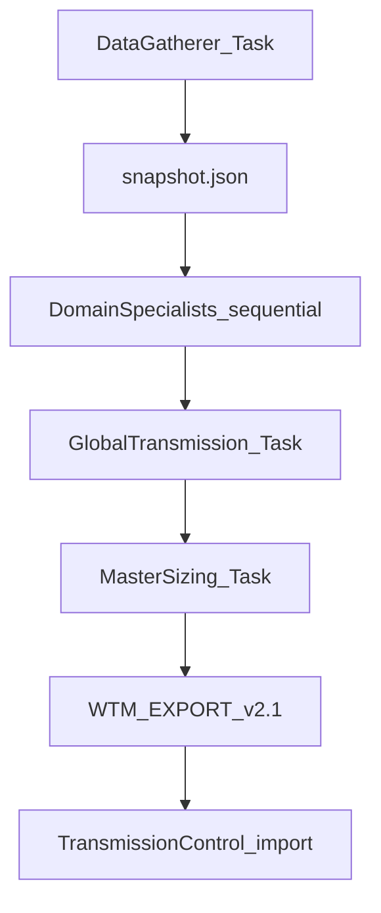

> Sequential Grok Task Force pipeline: DataGatherer snapshot → domain specialists (incl. China SQ3, SOFR-FF, HY-IG, Global Transmission) → MasterSizing synthesis. Prompt automation first; no heavy UI.

# Task Force Arena — Integration Consensus (v2)

**Status:** Plan approved · **Not implemented** · session stopped (context limit)  
**Date:** July 3, 2026  
**Authority:** [08_Deliverables/Whinfell_Care_Package_20260703.md](../08_Deliverables/Whinfell_Care_Package_20260703.md)

## Specialist roster (arena + mandatory additions)

| specialist_id | node_id / anchor | Role |
|---------------|------------------|------|
| `data_gatherer` | — | Hydration + `ingest_provenance` → structured `snapshot` JSON for all downstream Tasks |
| `btc_eth_basis` | `basis` | BTC/ETH basis + `execution` |
| `btc_eth_vol_arb` | `highbeta` | Vol arb + `layer2` gate |
| `compute_gpu` | `ai_compute` | GPU fwd / rental basis |
| `power_nat_gas` | `ai_compute` | MISO / nat gas power basis |
| `metals_debt` | `credit` | Metals + debt transmission |
| **`china_sq3_deep`** | `china` / `china_ladder` | **MANDATORY** qualitative SQ3 drivers (see below) |
| **`sofr_fedfunds`** | `liquidity` | **MANDATORY** SOFR–Fed Funds spread / front-end stress |
| **`hy_vs_ig`** | `credit` / `corporate_credit` | **MANDATORY** HY–IG spreads, compression, ETF basis |
| **`global_transmission`** | `cockpit_context` | **MANDATORY** Standalone global signal **without** SQ3/China |
| `master_sizing` | `cockpit_context` | Final synthesis + gross risk / layer2 caps |
| `tx_integrator` | Control + Map | WTM EXPORT v2.1 import bridge |

### China SQ3 Deep Dive — required output facets

Each facet: `{ signal, confidence, invalidation, sources[] }` (qualitative; no new vendor flows).

- `central_gov` — actions, policies, guidance
- `central_soe` — actions, policies, guidance
- `national_champions` — top 10 advised by Grok (Huawei, Fosun, Alibaba, Tencent + 6 others)
- `provincial_gov` — actions, policies, guidance
- `provincial_soe` — actions, policies, guidance

Feeds `china` + `sq3_score` / `sq3_band` context in DataGatherer snapshot; does not replace pipeline `china` block.

### Global Transmission Signal — required output

Standalone Whinfell transmission from **liquidity + credit + breadth + highbeta + basis only** (exclude SQ3/China):

- `global_only_score` (0–100)
- `global_transmission_state` (Normal / Stressed / Disorderly / Crisis)
- `key_drivers[]` (max 5)
- `vs_full_signal` — delta vs SQ3-inclusive `whinfell_score` + one-line interpretation

MasterSizing must consume both `global_transmission` and full `global` / `china` blocks.

---

## Arena debate outcomes (1 round, updated)

| Topic | Consensus |
|-------|-----------|
| **Control + Map** | No new Task Force shell. Map = Grok Task prompts; Control = import WTM EXPORT v2.1 + optional read of `task_force` in hydration. Light chips only later. |
| **JSON** | Additive `task_force` in `latest.json` (`task_force_version: "1.1.0"`). See schema below. |
| **Execution** | **Fully sequential:** DataGatherer → each domain specialist (ordered chain) → GlobalTransmission → MasterSizing → TxIntegrator. DataGatherer snapshot is sole shared input; each specialist appends its layer. |
| **Dictionary** | Register in `documentation/DATA_DICTIONARY_v1.5.md` + `data_dictionary_meta.json`. Align `specialist_id` ↔ `node_cockpits` ↔ existing `china` / `corporate_credit` blocks. Cousins YAML read-only. |



---

## Consensus Recommendation

1. **Priority = prompt automation**, not Control UI. Grok Tasks (manual or scheduled) run the pipeline; TC displays results via existing hydration import + WTM EXPORT parser (`js/core.js` ~L1857).
2. **DataGatherer first** — produces `task_force.snapshot` (trimmed hydration refs + provenance + node summaries). Downstream Tasks receive snapshot only, not full `latest.json`.
3. **New specialists mandatory** — China SQ3 Deep Dive, SOFR-Fed Funds, HY vs IG, Global Transmission integrated into arena roster and schema before original asset-class specialists ship.
4. **MasterSizing** merges all specialist layers + `global_transmission.vs_full_signal` conflict resolution → `gross_risk_pct`, `layer2_cap`, `verdict`.
5. **Map** — orchestrator prompt + per-specialist Task templates; output remains WTM EXPORT v2.1.

---

## `task_force` JSON schema (v1.1.0)

```json
{
  "task_force_version": "1.1.0",
  "as_of": "ISO-8601",
  "snapshot_id": "string",
  "pipeline_seq": ["data_gatherer", "...", "master_sizing"],
  "snapshot": { "hydration_ref": "...", "node_summaries": {}, "provenance": {} },
  "specialists": {
    "<specialist_id>": {
      "status": "ok|stub|error",
      "node_id": "basis|china|liquidity|credit|...",
      "signal": "string",
      "confidence": 0.0,
      "invalidation": "string",
      "as_of": "ISO-8601"
    },
    "china_sq3_deep": {
      "facets": {
        "central_gov": {},
        "central_soe": {},
        "national_champions": { "names": [], "notes": "" },
        "provincial_gov": {},
        "provincial_soe": {}
      }
    },
    "global_transmission": {
      "global_only_score": 0,
      "global_transmission_state": "string",
      "key_drivers": [],
      "vs_full_signal": { "full_score": 0, "delta": 0, "interpretation": "" }
    }
  },
  "master_sizing": {
    "gross_risk_pct": 0,
    "layer2_cap": "string",
    "verdict": "EXECUTE|WATCH|BLOCKED",
    "conflicts": [],
    "global_vs_full_weight": "string"
  }
}
```

Persist final artifact to hydration `task_force` block after MasterSizing; Control import unchanged.

---

## Minimal Implementation Plan (3 chunks) — revised

### Chunk 1 — DataGatherer Task + JSON schema (~1h)

- Define `task_force` v1.1.0 in `documentation/DATA_DICTIONARY_v1.5.md` + `data_dictionary_meta.json`.
- **DataGatherer Grok Task template** — inputs: `latest.json` path or pasted `global` + `node_cockpits` + `china` + `ingest_provenance`; output: `snapshot` JSON only.
- Specialist→node mapping table (full roster above).
- Stub `task_force` in TC/Cousins bundle (`validation_status: stub`).

### Chunk 2 — Specialist Task templates + sequential chain script (~1–2h)

- One compact Grok Task prompt per specialist (incl. China SQ3 facets, SOFR-FF, HY-IG, Global Transmission).
- **`scripts/run_task_force_chain.sh`** (or `whinfell_pipeline/task_force/chain.py`) — sequential invoke order; each step reads prior `task_force.json`, appends specialist layer.
- No parallel execution; snapshot passed to every step.
- Dictionary field names only; no new vendor URLs.

### Chunk 3 — MasterSizing + Grok Task launcher (~1h)

- **MasterSizing Task** — inputs: full `task_force.specialists` + `global_transmission.vs_full_signal`; outputs: `master_sizing` + WTM EXPORT v2.1 block.
- **Launcher** — manual `run_task_force_chain.sh` + doc for scheduled Grok Tasks; optional merge into hydration via `scripts/copy_hydration_bundle.sh`.
- Verify WTM EXPORT import fills `global` + `cockpit_context` (`js/core.js`).
- Optional one-pager: `08_Deliverables/Task_Force_Arena_Spec.md`.

**Deferred (post-gate):** Control summary strip / per-node chips — only after Clark wires Koyfin URLs + full chain.

**Gate:** Clark wires Koyfin Watchlist `/myw/` → `daily --chain` → hydration copy → first live Task Force run.

---

## Token-saving tips

- **Sequential Tasks:** Pass `snapshot` + previous specialist **summaries** (3 fields each), not full chain history.
- **China SQ3:** One facet per bullet; national_champions list fixed once per session.
- **Global Transmission:** Output 5 drivers max; `vs_full_signal` = 2 numbers + 1 sentence.
- **DataGatherer:** Trim hydration to required blocks only (`global`, `china`, `node_cockpits`, `execution`, `corporate_credit`, `flows_health`, `ingest_provenance`).
- **Arena:** 1 round; ≤5 bullets per specialist in debate docs.
- **Sessions:** New Grok session per chunk; compress at 25% (`prompts/BUILD_MASTER_PROMPT_20260630.md`).

## Todos

- [ ] **chunk1-gatherer** — DataGatherer Grok Task template + task_force v1.1.0 schema in dictionary + stub bundle
- [ ] **chunk2-chain** — Specialist Task prompts (12 specialists) + sequential chaining script
- [ ] **chunk3-sizing** — MasterSizing Task + launcher + WTM EXPORT v2.1 merge into hydration